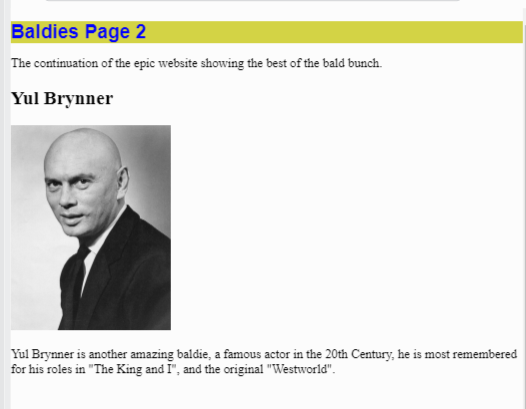
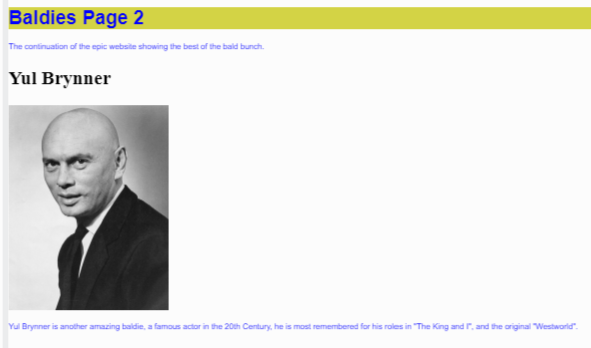

# CSS

So far, our webpages have been pretty boring - white background, black text, default fonts, etc.

To make life more interesting, we're going to learn how to use **cascading style sheets** (CSS) to beautify our pages.

CSS has made this a **lot** easier, since before it, web coders had to individually tell each element how to look. CSS lets us create default settings & formats and apply them to parts of our page. It's a bit like having formatting subroutines that you can call at any time.
##
👉 You may have already noticed a **style.css** file in your left hand file pane, and this line in our boilerplate code:

```html
<link href="style.css" rel="stylesheet" type="text/css" />
```

This means that any repl you create automatically comes with it's own styling file that is loaded into the webpage.

This is what the starter style.css page looks like:

```css
html, body {
  height: 100%;
  width: 100%;
}
```

This CSS code tells the `<head>` and `<body>` tags how to look. They have a height & width of 100% (ie they fill the page).

Now let's start creating a webpage and learning about the tags.

👉 I've created a basic baldy page here (It's already in the `index.html` file for you.):

```html
<html>

<head>
  <meta charset="utf-8">
  <meta name="viewport" content="width=device-width">
  <title>replit</title>
  <link href="style.css" rel="stylesheet" type="text/css" />
</head>

<body>
  
  <h1>Baldies Page 2</h1>
  <p>The continuation of the epic website showing the best of the bald bunch.</p>

  <h2>Yul Brynner</h2>
  
  <p>Yul Brynner is another amazing baldie, a famous actor in the 20th Century, he is most remembered for his roles in "The King and I", and the original "Westworld".</p>
  
</body>

</html>

```

## Before you get started...

- The curly braces are important - they surround the style for each tag.
- Each line should finish with a semi colon - or it won't work.
- Font family lets you pick a particular font or *general style* for your text.  It's generally good practice to use general style rather than specify one font, because the one you pick might not be supported by all web browsers.  [Check out some web safe fonts here.](https://www.w3schools.com/cssref/css_websafe_fonts.php)
- A cool Replit feature is to give you a color picker when you type the color name.  You can click on the colored box to fine tune your color selection.
## Heading Style
👉 The first thing I'm going to style is the heading.  I do this in the **style.css** page by creating a new style for the `<h1>` tag.  The settings I create here will be applied to **all the `<h1>` tags** in my html file.


```css
html, body {
  height: 100%;
  width: 100%;
}

h1{
  font-family: sans-serif;
  font-size: 24px;
  color: blue;
  background-color: #d3d345;
    
}

```

Let's see what this code has done to my webpage. Go back to the index.html file and refresh the webview pane:



## Paragraph Style
👉 Now, I'm going to style my `<p>` tags:
```css
html, body {
  height: 100%;
  width: 100%;
}

h1{
  font-family: sans-serif;
  font-size: 24px;
  color: blue;
  background-color: #d3d345;
    
}

p{
  font-family: sans-serif;
  font-size: 10px;
  color: blue;
 
    
}

```

This has changed my paragraphs to smaller, blue text.



## Background Color
👉 To set the background color for the whole page, add the setting to the `html, body` style:

```css
html, body {
  height: 100%;
  width: 100%;
  [background-color: red;](background-color: #e4e2e2;)
}

```
### Try it out! But remember that just because you can change a setting, doesn't mean you should! Sometimes good design is all about restraint!